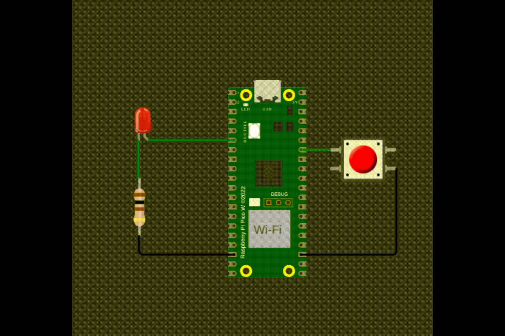

# exe 1

Pisca LED chique!

Quando o botão pressionado inicialize um timer repetitivo que opere a **500 ms**, sempre que o timer estourar, você deve mudar o valor do LED. Quando o botão for pressionado novamente, pare a execução do timer (`cancel_repeating_timer`).

Tanto o botão quanto o LED devem operar com interrupção, lembrem de realizarem as operacoes na função main e não nos callbacks.

- O LED deve sempre começar e terminar no estado apagado!

## Regras de implementação do firmware:

- Baremetal (sem RTOS).
- Utilizar timers.
    - Não é permitido usar `sleep_ms(), sleep_us(), get_absolute_time()`.
- **Deve trabalhar com interrupções nos botões**.  
    - Nao e permitido usar `gpio_get()`.
- **printf** pode atrapalhar o tempo de simulação, comenta/remova antes de testar.

## Testes

O código deve passar em todos os testes para ser aceito:

- `embedded_check`
- `firmware_check`
- `wokwi`
