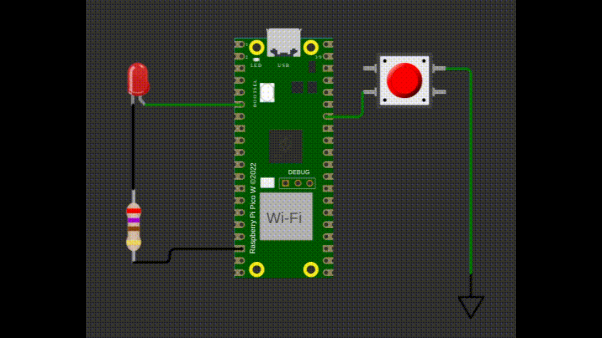

# exe 3

Aperto longo.

Só considerar o botão como ativado quando ele for solto após ter sido mantido por um tempo longo pressionado (mais que **500 ms**), isso deve ligar e desligar o LED.

- Os LED devem sempre começar e terminar no estado apagado!

## Dica

Da para fazer usando o tempo absoluto ou usando o alarme!

## Regras de implementação do firmware:

- Baremetal (sem RTOS).
- Utilizar timers.
    - Não é permitido usar `sleep_ms(), sleep_us(), get_absolute_time()`.
- **Deve trabalhar com interrupções nos botões**.  
    - Nao e permitido usar `gpio_get()`.
- **printf** pode atrapalhar o tempo de simulação, comenta/remova antes de testar.

## Testes

O código deve passar em todos os testes para ser aceito:

- `embedded_check`
- `firmware_check`
- `wokwi`
